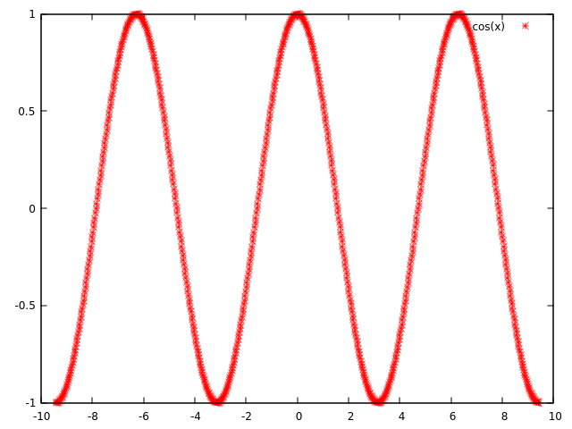

# fixed-point

32 bit fixed-point[<sup>\*1</sup>](#note1) library

<a id="note1">\*1: Q format</a>

## Env
- Linux: Ubuntu 18.04
- gcc: gcc (Ubuntu 7.4.0-1ubuntu1~18.04.1) 7.4.0
- etc.: [gnuplot](http://www.gnuplot.info/)

## Feature
|Name|Content|
|:--|:--|
|float\_to\_fr32(float real, uint8\_t sft)|Convert float to fixed-point|
|float\_to\_fr32\_pih(uint8\_t sft)|Convert (float)M\_PI/2 to fixed-point|
|double\_to\_fr32(double real, uint8\_t sft)|Convert double to fixed-point|
|double\_to\_fr32\_pih(uint8\_t sft)|Convert (double)M\_PI/2 to fixed-point|
|fr32\_to\_float(int32\_t fr32, uint8\_t sft)|Convert fixed-point to float|
|fr32\_to\_double(int32\_t fr32, uint8\_t sft)|Convert fixed-point to double|
|mul\_fr32(int32\_t a, int32\_t b, uint8\_t sft)|Multiplication of fixed-point|
|div\_fr32(int32\_t a, int32\_t b, uint8\_t sft)|Division of fixed-point|
|cos\_fr32(int32\_t x, uint8\_t sft)|Fixed-point cosine function|
|sin\_fr32(int32\_t x, uint8\_t sft)|Fixed-point sine function|

## Demo Cos(x)
```bash
$ make
$ ./build/fixed-point -t 6 -s 64 24
```



## LICENSE
[](./LICENSE)
